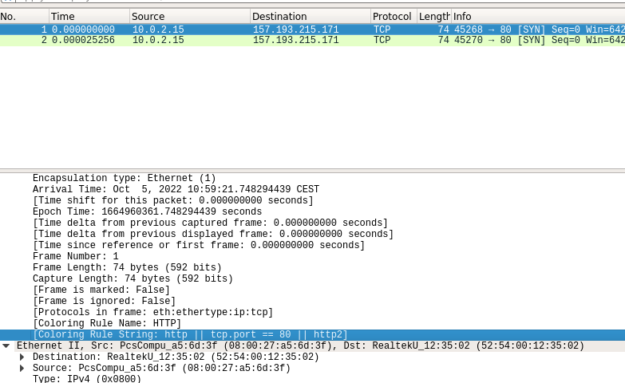
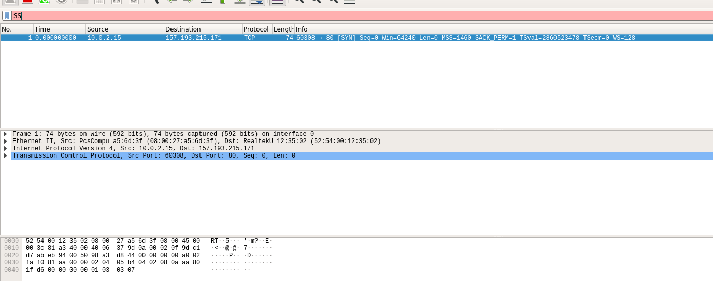
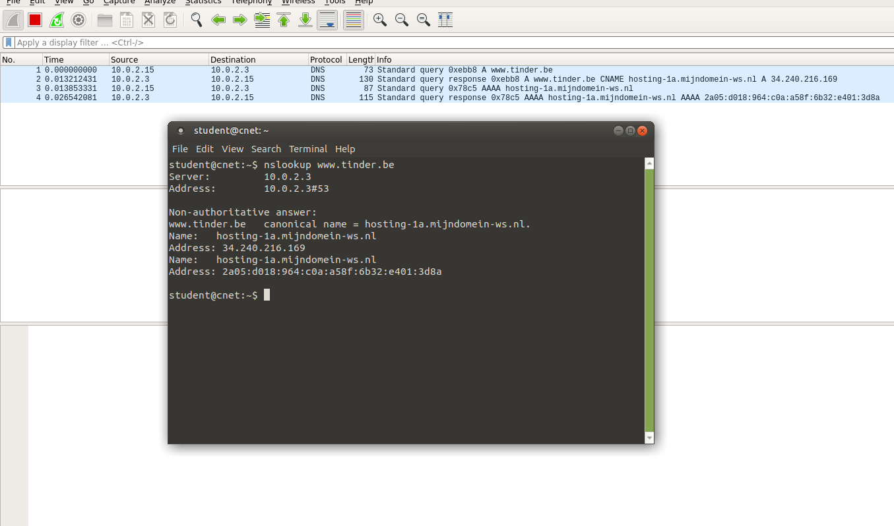

# Lab 1

## Email versturen

## Opdrachten met telnet

### Opdracht 1

Verbind met home.test.atlantis.ugent.be op poort 23, maak op deze server in je thuismap een bestand aan met jouw naam en studentennummer er in, genaamd ‘mijnInfo.txt’.

Verbinden met de server:

```bash
student@cnet:~$ telnet home.test.atlantis.ugent.be 23
Trying 157.193.215.170...
Connected to home.test.atlantis.ugent.be.
Escape character is '^]'.

Linux 4.9.0-19-amd64 (home.test.atlantis.ugent.be) (pts/9)

home login: rodbel
Password: 
Last login: Wed Oct  5 09:50:05 CEST 2022 from 172.17.176.84 on pts/11
Linux home 4.9.0-19-amd64 #1 SMP Debian 4.9.320-2 (2022-06-30) x86_64

The programs included with the Debian GNU/Linux system are free software;
the exact distribution terms for each program are described in the
individual files in /usr/share/doc/*/copyright.

Debian GNU/Linux comes with ABSOLUTELY NO WARRANTY, to the extent

```

Bestand aanmaken:

```bash
rodbel@home:~$ ls
README
rodbel@home:~$ touch mijnInfo.txt
rodbel@home:~$ ls
mijnInfo.txt  README
rodbel@home:~$ nano mijnInfo.txt 
rodbel@home:~$ ls
mijnInfo.txt  README
rodbel@home:~$ cat mijnInfo.txt 
naam: Robin Debel
studentennummer: 02210959

rodbel@home:~$ 

```

### Opdracht 2

Verbind met deze zelfde server, maar nu op poort 13. Beschrijf de info die je ziet.

```bash
student@cnet:~$ telnet home.test.atlantis.ugent.be 13
Trying 157.193.215.170...
Connected to home.test.atlantis.ugent.be.
Escape character is '^]'.
Wed Oct  5 10:18:09 2022
Connection closed by foreign host.

```

Verbinding werkt maar sluit zichzelf terug direct af.

### Opdracht 3

Hoe kan je met telnet testen of deze server ook een FTP daemon werkende heeft?

Door te verbinden met de server op poort 21.

```bash

student@cnet:~$ telnet home.test.atlantis.ugent.be 21
Trying 157.193.215.170...
Connected to home.test.atlantis.ugent.be.
Escape character is '^]'.
220 ProFTPD 1.3.5b Server (Debian) [157.193.215.170]

```

Hier zien we dat een verbinding tot stand gebracht kan worden en er dus een FTP daemon werkende is.

### Opdracht 4

Verbind met telnet met de mailserver mail.test.atlantis.ugent.be en verstuur een mail naar jezelf vanuit deze telnet verbinding (welke poort?). Let wel: backspace werkt meestal niet bij dit soort verbindingen, dus werk met de precisie die ook een computerprogramma zou hanteren.

```bash

student@cnet:~$ telnet mail.test.atlantis.ugent.be 25 
Trying 157.193.215.172...
Connected to mail.test.atlantis.ugent.be.
Escape character is '^]'.
220 mail.test.atlantis.ugent.be ESMTP Postfix (Debian/GNU)
HELO debelbobie@gmail.com
250 mail.test.atlantis.ugent.be
MAIL FROM: debelbobie@gmail.com
250 2.1.0 Ok
DATA
554 5.5.1 Error: no valid recipients
RCPT TO: rodbel@test.atlantis.ugent.be
250 2.1.5 Ok
DATA
354 End data with <CR><LF>.<CR><LF>
Dit is een mailtje verzonden via telnet
.
250 2.0.0 Ok: queued as E187DC105B
QUIT
221 2.0.0 Bye
Connection closed by foreign host.
student@cnet:~$ 

```

### Opdracht 5

Lees nadien deze mail door met dezelfde server te verbinden, maar gebruik nu poort 110 (POP).

```bash

student@cnet:~$ telnet mail.test.atlantis.ugent.be 110
Trying 157.193.215.172...
Connected to mail.test.atlantis.ugent.be.
Escape character is '^]'.
+OK Hello there.
USER rodbel
+OK Password required.
PASS 02210959
+OK logged in.
STAT
+OK 2 726
RETR 2
+OK 379 octets follow.
Return-Path: <debelbobie@gmail.com>
X-Original-To: rodbel@test.atlantis.ugent.be
Delivered-To: rodbel@test.atlantis.ugent.be
Received: from debelbobie?gmail.com (unknown [172.17.176.84])
by mail.test.atlantis.ugent.be (Postfix) with SMTP id E187DC105B
for <rodbel@test.atlantis.ugent.be>; Wed,  5 Oct 2022 10:32:56 +0200 (CEST)

Dit is een mailtje verzonden via telnet
.
QUIT
+OK Bye-bye.
Connection closed by foreign host.

```

### Opdracht 6

Stuur een mail naar gebruiker avmaele@test.atlantis.ugent.be. Kan je een subject3 instellen (Labo 1 – mail)? Als inhoud van de mail stuur je één zin.

```bash

student@cnet:~$ telnet mail.test.atlantis.ugent.be 25 
Trying 157.193.215.172...
Connected to mail.test.atlantis.ugent.be.
Escape character is '^]'.
220 mail.test.atlantis.ugent.be ESMTP Postfix (Debian/GNU)
HELO rodbel@test.atlantis.ugent.be
250 mail.test.atlantis.ugent.be
MAIL FROM: rodbel@test.atlantis.ugent.be
250 2.1.0 Ok
RCPT TO: avmaele@test.atlantis.ugent.be
250 2.1.5 Ok
DATA
354 End data with <CR><LF>.<CR><LF>
Subject: Chickens
LOOK AT ALL THOSE CHICKENS

THEY GORGEOUS
.
250 2.0.0 Ok: queued as 2CAC0C1074
QUIT
221 2.0.0 Bye
Connection closed by foreign host.

```

### Opdracht 7

Wat doet het commando NOOP bij het POP protocol. Lees dit na in RFC 1939.

NOOP is een commando dat de server niets laat doen. Het is een commando dat gebruikt wordt om de verbinding te testen.

### Opdracht 8

Download met behulp van wget4 een script via HTTP:
wget www.test.atlantis.ugent.be/capture_syn.sh
Start op de CLI van jouw Virtuele Linux het script “./capture_syn.sh”. Dit start Wireshark op, en
captured enkel de start van een TCP verbinding – niks meer. Surf vervolgens met Firefox naar de
site ‘www.test.atlantis.ugent.be’. Kan je uit de Wireshark info afleiden welke versie van HTTP
deze server ondersteunt? Leg uit.

```bash

student@cnet:~$ wget www.test.atlantis.ugent.be/capture_syn.sh
--2022-10-05 10:54:29--  http://www.test.atlantis.ugent.be/capture_syn.sh
Resolving www.test.atlantis.ugent.be (www.test.atlantis.ugent.be)... 157.193.215.171
Connecting to www.test.atlantis.ugent.be (www.test.atlantis.ugent.be)|157.193.215.171|:80... connected.
HTTP request sent, awaiting response... 200 OK
Length: 109 [text/x-sh]
Saving to: ‘capture_syn.sh’

capture_syn.sh      100%[===================>]     109  --.-KB/s    in 0s      

2022-10-05 10:54:29 (28.5 MB/s) - ‘capture_syn.sh’ saved [109/109]

student@cnet:~$ 

```

Wireshark opstarten:

```bash

student@cnet:~$ sudo chmod u+x ./capture_syn.sh 
student@cnet:~$ ./capture_syn.sh
QStandardPaths: XDG_RUNTIME_DIR not set, defaulting to '/tmp/runtime-root'

```

surfen naar www.test.atlantis.ugent.be



We kunnen zien dat de server http2.0 ondersteunt.

### Opdracht 9

Maak met telnet verbinding met dezelfde webserver (welke poort?) en vraag de hoofdpagina op door de HTTP commando’s door te geven in je telnet verbinding.

```bash

student@cnet:~$ telnet www.test.atlantis.ugent.be 80
Trying 157.193.215.171...
Connected to www.test.atlantis.ugent.be.
Escape character is '^]'.
GET / HTTP/1.0

HTTP/1.1 200 OK
Date: Wed, 05 Oct 2022 09:06:54 GMT
Server: Apache/2.4.25 (Debian)
Last-Modified: Tue, 09 Mar 2021 19:40:26 GMT
ETag: "25d-5bd1fb8de3482"
Accept-Ranges: bytes
Content-Length: 605
Vary: Accept-Encoding
Connection: close
Content-Type: text/html

<!DOCTYPE html> 
<HTML lang="en">
<HEAD>
   <meta charset="UTF-8">
   <TITLE>Welcome to the Application Layer Lab Page!</TITLE>
   <link rel="icon" href="data:,">
</HEAD>
<BODY>

<H1>Welcome to all ComNet students</H1>

<p>This is the experimental server for the communication networks (ComNet) exercises. Please report anything unusual to one of the tutors of this course.
</p>

<p> A link to the Debian 10 Mate appliance can be found <a href="./Deb10mate-appl.ova">here</a>
-->

<p>


<!-- This image should not be seen

-->

</HTML>
Connection closed by foreign host.
student@cnet:~$ ./capture_syn.sh

```

### Opdracht 10

Surf met Lynx naar de webserver; tegelijk capture je opnieuw het aantal TCP verbindingen met het script uit de voorgaande vraag. Is er een verschil. Kan je dit verklaren?

```bash

lynx www.test.atlantis.ugent.be

```



Er is geen verschil.

### Opdracht 11

Download met behulp van wget een script via HTTP, dat je in het volgende luik kan gebruiken: wget www.test.atlantis.ugent.be/capture_dns.sh

```bash

student@cnet:~$ wget www.test.atlantis.ugent.be/capture_dns.sh
--2022-10-05 11:15:40--  http://www.test.atlantis.ugent.be/capture_dns.sh
Resolving www.test.atlantis.ugent.be (www.test.atlantis.ugent.be)... 157.193.215.171
Connecting to www.test.atlantis.ugent.be (www.test.atlantis.ugent.be)|157.193.215.171|:80... connected.
HTTP request sent, awaiting response... 200 OK
Length: 107 [text/x-sh]
Saving to: ‘capture_dns.sh’

capture_dns.sh      100%[===================>]     107  --.-KB/s    in 0s      

2022-10-05 11:15:40 (16.2 MB/s) - ‘capture_dns.sh’ saved [107/107]

student@cnet:~$ 

student@cnet:~$ sudo chmod u+x capture_dns.sh 
```

## DNS queries

### opdracht 1

Welk IP-adres heeft www.ugent.be? Welke servers zijn verantwoordelijk voor dit domein?

```bash
student@cnet:~$ nslookup www.ugent.be
Server:		10.0.2.3
Address:	10.0.2.3#53

Name:	www.ugent.be
Address: 157.193.43.50
```

### opdracht 2

wwww.belnet.be geeft een IP-adres terug, maar als je dit IP-adres probeert om te zetten in een URL (reverse lookup) merk je dat de server een andere naam heeft. Welke? Licht toe hoe je dit vond.

```bash
student@cnet:~$ nslookup www.belnet.be
Server:		10.0.2.3
Address:	10.0.2.3#53

Non-authoritative answer:
Name:	www.belnet.be
Address: 217.19.230.167
Name:	www.belnet.be
Address: 2a00:1c98:10:2c::10

student@cnet:~$ dig -x 217.19.230.167

; <<>> DiG 9.11.3-1ubuntu1.18-Ubuntu <<>> -x 217.19.230.167
;; global options: +cmd
;; Got answer:
;; ->>HEADER<<- opcode: QUERY, status: NOERROR, id: 22185
;; flags: qr rd ra; QUERY: 1, ANSWER: 1, AUTHORITY: 0, ADDITIONAL: 1

;; OPT PSEUDOSECTION:
; EDNS: version: 0, flags:; udp: 1232
; COOKIE: 3d6f18ac5eecb1f001000000633d4f7103e6a3de8d0711d9 (good)
;; QUESTION SECTION:
;167.230.19.217.in-addr.arpa.	IN	PTR

;; ANSWER SECTION:
167.230.19.217.in-addr.arpa. 84902 IN	PTR	217.19.230.167.static.hosted.by.combell.com.

;; Query time: 2 msec
;; SERVER: 10.0.2.3#53(10.0.2.3)
;; WHEN: Wed Oct 05 11:33:38 CEST 2022
;; MSG SIZE  rcvd: 141

student@cnet:~$ 

```

### opdracht 3

Resolve de URL www.tinder.com verschillende keren na elkaar, en gebruik verschillende nameservers. Herhaal hetzelfde op de home server (log in met SSH), die andere DNS-servers gebruikt. Beschrijf wat je ziet - waarom gaat een groot bedrijf op deze manier te werk?

```bash
student@cnet:~$ nslookup www.tinder.com
Server:		10.0.2.3
Address:	10.0.2.3#53

Non-authoritative answer:
Name:	www.tinder.com
Address: 13.224.132.116
Name:	www.tinder.com
Address: 13.224.132.36
Name:	www.tinder.com
Address: 13.224.132.59
Name:	www.tinder.com
Address: 13.224.132.81

student@cnet:~$ ssh -l rodbel home.test.atlantis.ugent.be

rodbel@home:~$ nslookup www.tinder.com
Server:		157.193.215.2
Address:	157.193.215.2#53

Non-authoritative answer:
Name:	www.tinder.com
Address: 13.225.239.86
Name:	www.tinder.com
Address: 13.225.239.61
Name:	www.tinder.com
Address: 13.225.239.114
Name:	www.tinder.com
Address: 13.225.239.36

rodbel@home:~$ 

```

Tinder gaat op deze manier tewerk zodat ze gemakkelijk kunnen loadbalanceren en redundantie kunnen garanderen.

### opdracht 4

Start in je Linux VM het script capture_dns.sh6 op dat je downloadde; voer de lookup naar www.tinder.com opnieuw uit. Hoeveel DNS requests werden er naar de server gestuurd, hoeveel antwoorden kreeg je terug?

```bash
student@cnet:~$ sudo ./capture_dns.sh
```



er werden 2 requests gestuurd en 2 antwoorden teruggekregen.
