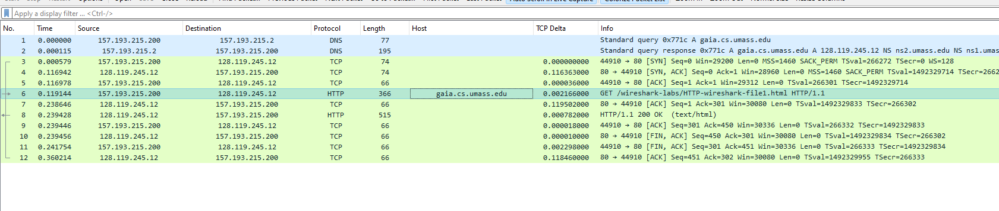
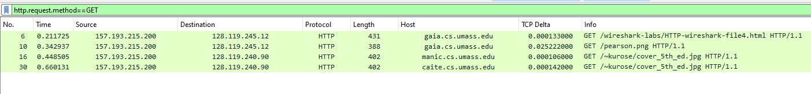
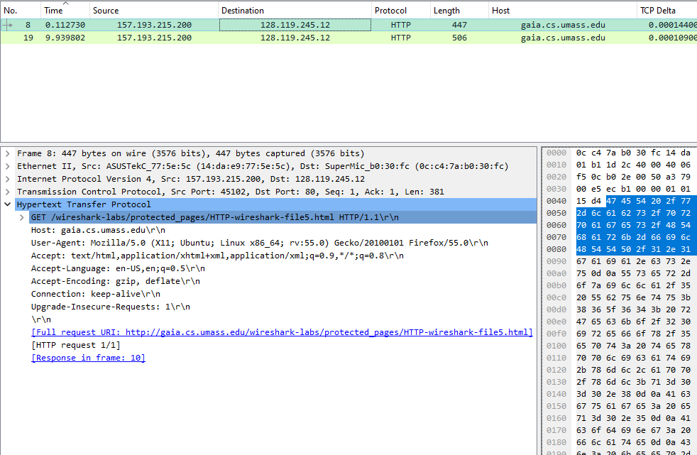
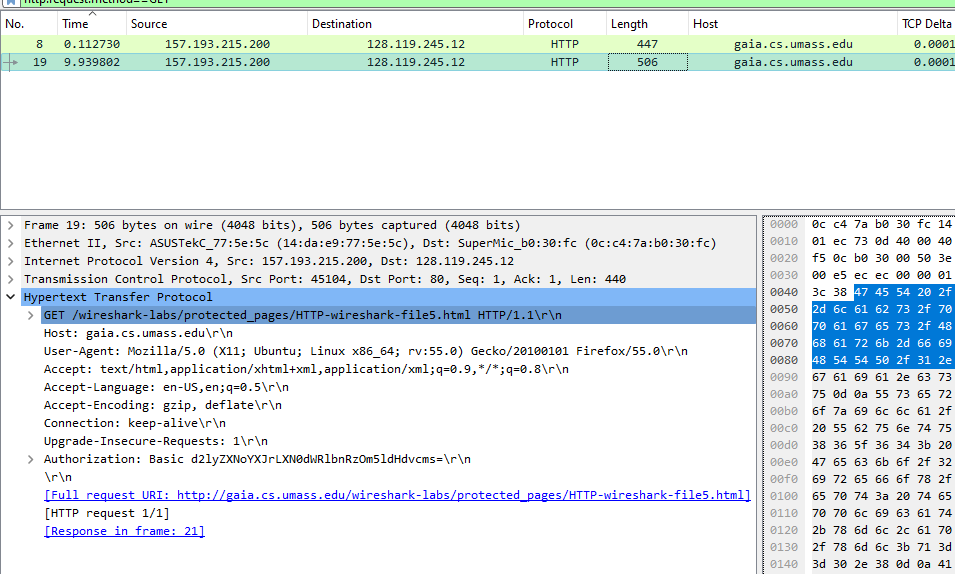
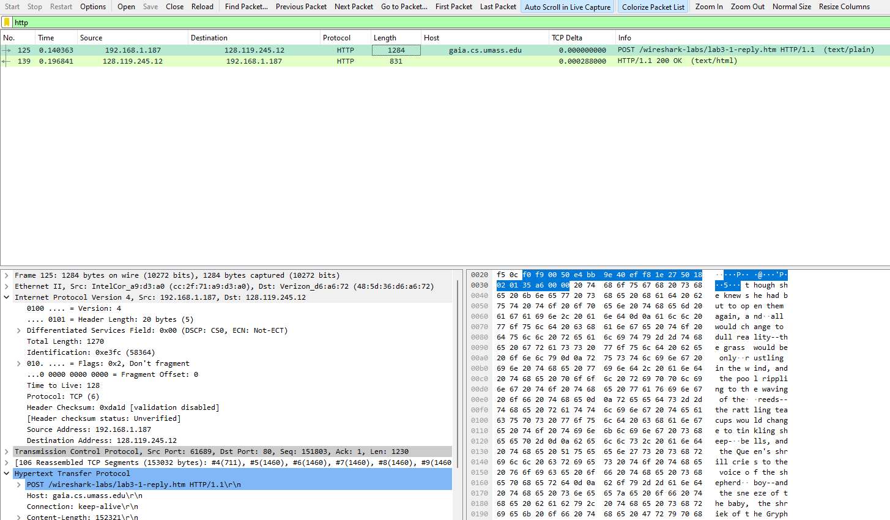

# Lab 2-Wireshark- Wireshark Lab: HTTP

## The Basic HTTP GET/response interaction

### Is your browser running HTTP version 1.0, 1.1, or 2?  What version of HTTP is the server running?

The browser is running HTTP version 1.1 and the server is running HTTP version 1.1 as well.

## HTML Documents with Embedded Objects

### How many HTTP GET request messages did your browser send?  To which Internet addresses (URL) were these GET requests sent?

The browser sent 4 HTTP GET request messages to the following addresses:

- <http://gaia.cs.umass.edu/wireshark-labs/HTTP-wireshark-file4.html>

- <http://gaia.cs.umass.edu/pearson.png>

- <http://manic.cs.umass.edu/~kurose/cover_5th_ed.jpg>

- <http://caite.cs.umass.edu/~kurose/cover_5th_ed.jpg>

### Can you tell whether your browser downloaded the two images serially, or  whether they were downloaded from the two web sites in parallel?  Explain

The pictures were downloaded parallel, the tcp streams overlap.

## HTTP Authentication

### When your browser’s sends the HTTP GET message for the second time, what  new field is included in the HTTP GET message?

The new field is the Authorization field. It contains the username and password.

# Wireshark Lab: TCP

## The capture file

02.tcp-wireshark-trace1-1.pcap trace file

### What is the IP address and TCP port number used by the client computer (source) that is transferring the alice.txt file to gaia.cs.umass.edu?

ip address: 192.168.1.187

port number: 61689

### What is the IP address of gaia.cs.umass.edu? On what port number is it sending and receiving TCP segments for this connection?

ip address: 128.119.245.12

port number: 80

### How many bytes of data are contained in the payload (data) field of this TCP segment? Did all of the data in the transferred file alice.txt fit into this single segment?

The field contains 711 bytes of data. No, not all of the data fit into this single segment.

### What is the length (header plus payload) of each of the first four data-carrying TCP segments?

The length is 1460 bytes.