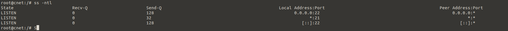
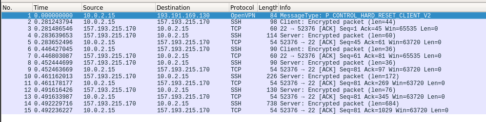

# Lab 4 - Sockets

## Listening Sockets – daemon software

### Opdracht server ports

1. Bekijk welke poorten er allemaal actief zijn op jouw VM. Stop de DNS daemon bind9, en bemerk het verschil. Welke poorten gebruikt de DNS daemon allemaal?

    

    

    

2. Verwijder het programma 'cups-daemon'. Welke poort was er in gebruik door de software (voor printer-services die we niet gebruikten)?

    Before:
    

    After:
    

3. Installeer de software apache2. Kan je merken welke poort er actief geworden is?

    Before:
    

    After:
    

4. Installeer de software nginx. Deze daemon wil echter niet opstarten. Leg uit waarom.

    

    De daemon wil niet opstarten omdat de poort 80 al in gebruik is door apache2.

5. Stel de poort van apache2 in op 8080 – dit kan via het bestand /etc/apache2/ports.conf. Herlaad deze daemon. Kan je de wijziging zien in je listening sockets? Zou je nu nginx kunnen opstarten? Leg uit.

    
    Ja je kan zien dat de serverpoort nu veranderd is.

    
    Nginx kan nu wel opstarten. dit komt omdat de poort 80 nu vrij is.

## Intermezzo 1: HTTP op de CLI

1. Start wireshark op binnen je VM, met sudo wireshark.

   ```bash
    sudo wireshark
    ```

2. Terwijl je captured op de interface, vraag je met curl de ugent pagina op. Zie je het TCP gesprek horend bij deze applicatie?

    

## Active Sockets – client and daemon software

### Opdracht actieve sockets

1. Maak een SSH verbinding naar home.test.atlantis.ugent.be ; bekijk voordien en nadien de uitkomst met ss –tn. Leg uit vanaf wanneer een poortnummer in gebruik is op een client.

    Voordien:
    

    Verbinding maken:
    

    Nadien:
    

2. Maak nadien een tweede SSH verbinding vanaf dezelfde client. Leg uit a.d.h.v. het resultaat van ss hoe de pakketten van deze beide verbindingen door de computers uit elkaar kunnen gehouden worden.

    
    De pakketten worden uit elkaar gehouden door de client poorten.

3. Bekijk de listening sockets op deze server. Leg van 3 poorten uit welke functie ze vervullen op de server. Hint: bekijk de inhoud van het bestand /etc/services.

    

    etc/services:
    

    Poort 21: FTP/FSP
    Poort 22: SSH
    Poort 23: Telnet

4. Je installeerde reeds de nginx webserver. Kan je met netcat testen of hij werkt op jouw systeem? Hoe doe je dat? Kan je met wget het index.html downloaden?

    
    De webserver werkt.

    
    Je kan het index.html downloaden met wget.

5. Je installeerde reeds de apache2 webserver, en werkte het poortnummer bij. Kan je met netcat testen of hij werkt op jouw systeem? Hoe doe je dat? Kan je met wget het index.html downloaden?

    
    De webserver werkt.

    
    Je kan het index.html downloaden met wget.

6. Stel een poortnummer open op je computer (netcat listening socket), zodat je er vanuit een 2e terminal met netcat mee kan verbinden. Kan je dit combineren met input/output redirection (zie vorig labo), zodat je het bestand /etc/services kan sturen van de ene terminal naar de andere doorheen deze TCP socket? Hint: <http://www.microhowto.info/howto/copy_a_file_from_one_machine_to_another_using_netcat>

   ```bash
    nc -l 60000 > qux.txt
    ```

    ```bash
    nc -q 0 localhost 60000 < qux.txt
    ```

    

## Intermezzo 2: Secure CoPy (SCP)

1. Aanmaken tarbal

    ```bash
    tar -czf gundams.tar.bz2 gundams/
    ```

    

2. SCP kopieren

    ```bash
    scp gundams.tar.bz2 rodbel@home.test.atlantis.ugent.be:~/
    ```

    Uitpakken op de server

    ```bash
    tar -xzf gundams.tar.bz2
    ```

    

## Socket scanning: NMAP

### Opdracht nmap

1. Voer een basisscan uit op scanme.nmap.org. Welke poorten zijn open? Welke poorten werden allemaal getest?

    ```bash
    nmap scanme.nmap.org
    ```

    

2. Voer een scan uit op de server home.test.atlantis.ugent.be. Welke poorten zijn er allemaal actief op deze server?

    ```bash
    nmap home.test.atlantis.ugent.be
    nmap -Pn home.test.atlantis.ugent.be
    ```

    

3. Start WireShark op, en start capturing. Scan met nmap je eigen Linux VM op poort 25. Stop het capturen. Welke status krijg je terug? Kan je dit linken aan de TCP-pakketten die je ziet?

    ```bash
    nmap -p 25 localhost
    ```

    
    De poort is closed

    de pakketten die je ziet zijn de SYN pakketten die worden gestuurd om de poort te openen. Deze worden niet beantwoord, dus de poort is closed.

4. Herhaal dit experiment, maar test nu poort 25 op de server. home.test.atlantis.ugent.be. Welke status krijg je terug? Kan je dit linken aan de TCP-pakketten die je ziet?

    ```bash
    nmap -Pn -p 25 home.test.atlantis.ugent.be
    ```

    )

    We zien dat de poort filtered is dit komt waarschijnlijk omdat de firewall de poort blokkeert.

5. Na stap 3 en 4 zou je het onderscheid moeten kunnen maken tussen open en filtered als status. Voer een basis portscan uit op www.meemoo.be, en formuleer welk advies je zou kunnen geven aan de beheerder van de firewall van deze server.

### Scan www.meemoo.be welke advies voor beheerder van firewall.

    ```bash
    nmap www.meemoo.be
    PORT     STATE    SERVICE
    22/tcp   open     ssh
    25/tcp   filtered smtp
    80/tcp   open     http
    113/tcp  filtered ident
    135/tcp  filtered msrpc
    139/tcp  filtered netbios-ssn
    443/tcp  open     https
    445/tcp  filtered microsoft-ds
    1433/tcp filtered ms-sql-s
    1434/tcp filtered ms-sql-m
    3389/tcp filtered ms-wbt-server
    4662/tcp filtered edonkey
    5666/tcp open     nrpe
    6346/tcp filtered gnutella
    6699/tcp filtered napster
    8008/tcp open     http
    9101/tcp open     jetdirect
    ```

The server has a lot of open and filtered ports.
Especially the open ssh ports seems like a security risk.