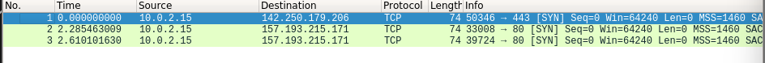
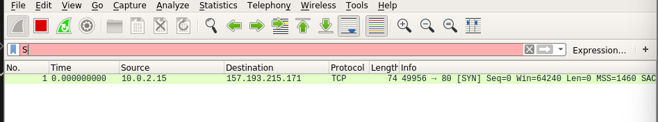
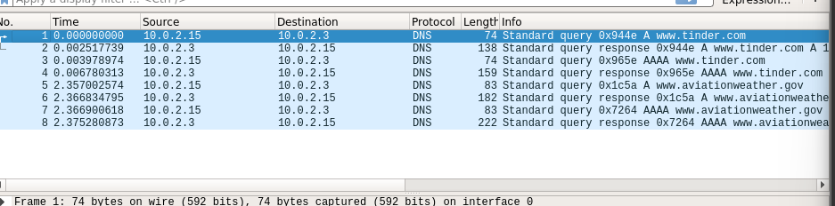

# Labo computernetwerken 1 – Applicatielaag

GEBRUIKERSNAAM arcoup

Tijdens dit eerste practicum leren we hoe applicaties communiceren met elkaar, en waarom er voor elke
applicatie aparte protocollen gespecifieerd zijn.

## Virtualbox email sturen:

telnet mail.test.atlantis.ugent.be 25
HELO gmail.com
MAIL FROM: arthurcoupe1230@gmail.com
RCPT TO: naam@gmail.com
emailbericht
QUIT

## Email verkrijgen:

telnet mail.test.atlantis.ugent.be 110 (praten tegen 110)
USER Naam
PASS password
LIST (lijst van mails die klaarstaan)
RETR 1 (lees email 1)

## Opdrachten met telnet aan de slag

### 1. bestand aanmaken

Verbind met home.test.atlantis.ugent.be op poort 23

```
student@cnet:~$ telnet home.test.atlantis.ugent.be 23
home login: arcoup
Password: 
arcoup@home:~$ cat > arthur02206174.txt
ls
arcoup@home:~$ ls
arthur02206174.txt  README
arcoup@home:~$ cat arthur02206174.txt 
ls
arcoup@home:~$ logout
```

### 2. Openen op poort 13

Verbind met deze zelfde server, maar nu op poort 13.

```
onnected to home.test.atlantis.ugent.be.
Escape character is '^]'.
Wed Oct  5 10:38:32 2022
Connection closed by foreign host.
```
Verbinding werkt maar sluit zichzelf niet af.

### 3. Hoe kan je met telnet testen of deze server ook een FTP daemon werkende heeft?

```
student@cnet:~$ telnet home.test.atlantis.ugent.be 21
Trying 157.193.215.170...
Connected to home.test.atlantis.ugent.be.
Escape character is '^]'.
220 ProFTPD 1.3.5b Server (Debian) [157.193.215.170]
```

### 4. telnet mail sturen

Verbind met telnet met de mailserver mail.test.atlantis.ugent.be en verstuur een mail naar jezelf
vanuit deze telnet verbinding (welke poort?)

Poort 25

```
student@cnet:~$ telnet mail.test.atlantis.ugent.be 25
Trying 157.193.215.172...
Connected to mail.test.atlantis.ugent.be.
Escape character is '^]'.
220 mail.test.atlantis.ugent.be ESMTP Postfix (Debian/GNU)
HELO mycomputer.homenet.be
250 mail.test.atlantis.ugent.be
MAIL FROM: arthurcoupe1230@gmail.com
250 2.1.0 Ok
RCPT TO: arcoup@test.atlantis.ugent.be
250 2.1.5 Ok
DATA
354 End data with <CR><LF>.<CR><LF>
test
.
250 2.0.0 Ok: queued as 750BDC1080
QUIT
221 2.0.0 Bye
Connection closed by foreign host.
```
### 5. mail lezen
Lees nadien deze mail door met dezelfde server te verbinden, maar gebruik nu poort 110 (POP).

```
student@cnet:~$ telnet mail.test.atlantis.ugent.be 110
Trying 157.193.215.172...
Connected to mail.test.atlantis.ugent.be.
Escape character is '^]'.
+OK Hello there.
USER arcoup
+OK Password required.
PASS 02206174
+OK logged in.
STAT
+OK 2 720
PETR 2
-ERR Invalid command.
RETR 2
+OK 351 octets follow.
Return-Path: <arthurcoupe1230@gmail.com>
X-Original-To: arcoup@test.atlantis.ugent.be
Delivered-To: arcoup@test.atlantis.ugent.be
Received: from mycomputer.homenet.be (unknown [172.17.175.236])
	by mail.test.atlantis.ugent.be (Postfix) with SMTP id 750BDC1080
	for <arcoup@test.atlantis.ugent.be>; Wed,  5 Oct 2022 10:58:21 +0200 (CEST)

test
.
QUIT
+OK Bye-bye.
Connection closed by foreign host.

```

### 6.Stuur een mail naar gebruiker avmaele@test.atlantis.ugent.be. 
Kan je een subject3 instellen (Labo1 – mail)? Als inhoud van de mail stuur je één zin. 

```
student@cnet:~$ telnet mail.test.atlantis.ugent.be 25
Trying 157.193.215.172...
Connected to mail.test.atlantis.ugent.be.
Escape character is '^]'.
220 mail.test.atlantis.ugent.be ESMTP Postfix (Debian/GNU)
HELO mycomputer.homenet.be
250 mail.test.atlantis.ugent.be
MAIL FROM arcoup@test.atlantis.ugent.be
501 5.5.4 Syntax: MAIL FROM:<address>
RCPT TO: avmaele@test.atlantis.ugent.be
503 5.5.1 Error: need MAIL command
MAIL FROM: arcoup@test.atlantis.ugent.be
250 2.1.0 Ok
RCPT TO: avmaele@test.atlantis.ugent.be
250 2.1.5 Ok
DATA
354 End data with <CR><LF>.<CR><LF>
Subject: Telnet Test
JUWW
.
250 2.0.0 Ok: queued as 398F9C107A
quit
221 2.0.0 Bye
Connection closed by foreign host.
```

### 7. Commando NOOP bij pop protocol

Wat doet het commando NOOP bij het POP protocol. Lees dit na in RFC 1939

Can be used to reset any inactivity auto-logout timer on the server.

### 8. WGET

Download met behulp van wget4 een script via HTTP:
wget www.test.atlantis.ugent.be/capture_syn.sh
Start op de CLI van jouw Virtuele Linux het script “./capture_syn.sh”. Dit start Wireshark op, en
captured enkel de start van een TCP verbinding – niks meer. Surf vervolgens met Firefox naar de
site ‘www.test.atlantis.ugent.be’. Kan je uit de Wireshark info afleiden welke versie van HTTP
deze server ondersteunt? Leg uit.



### 9 Maak met telnet verbinding met dezelfde webserver (welke poort?) 

en vraag de hoofdpagina op door de HTTP commando’s door te geven in je telnet verbinding.

```
student@cnet:~$ telnet www.test.atlantis.ugent.be 80
Trying 157.193.215.171...
Connected to www.test.atlantis.ugent.be.
Escape character is '^]'.
GET / HTTP/1.0

HTTP/1.1 200 OK
Date: Wed, 05 Oct 2022 09:28:27 GMT
Server: Apache/2.4.25 (Debian)
Last-Modified: Tue, 09 Mar 2021 19:40:26 GMT
ETag: "25d-5bd1fb8de3482"
Accept-Ranges: bytes
Content-Length: 605
Vary: Accept-Encoding
Connection: close
Content-Type: text/html

<!DOCTYPE html> 
<HTML lang="en">
<HEAD>
   <meta charset="UTF-8">
   <TITLE>Welcome to the Application Layer Lab Page!</TITLE>
   <link rel="icon" href="data:,">
</HEAD>
<BODY>

<H1>Welcome to all ComNet students</H1>

<p>This is the experimental server for the communication networks (ComNet) exercises. Please report anything unusual to one of the tutors of this course.
</p>

<p> A link to the Debian 10 Mate appliance can be found <a href="./Deb10mate-appl.ova">here</a>
-->

<p>


<!-- This image should not be seen

-->

</HTML>
Connection closed by foreign host.
```

### 10.Surf met Lynx naar de webserver

; tegelijk capture je opnieuw het aantal TCP verbindingen met
het script uit de voorgaande vraag. Is er een verschil. Kan je dit verklaren?



### 11. Download met behulp van wget een script via HTTP

```
student@cnet:~$ wget www.test.atlantis.ugent.be/capture_dns.sh
--2022-10-05 11:36:08--  http://www.test.atlantis.ugent.be/capture_dns.sh
Resolving www.test.atlantis.ugent.be (www.test.atlantis.ugent.be)... 157.193.215.171
Connecting to www.test.atlantis.ugent.be (www.test.atlantis.ugent.be)|157.193.215.171|:80... connected.
HTTP request sent, awaiting response... 200 OK
Length: 107 [text/x-sh]
Saving to: ‘capture_dns.sh’

capture_dns.sh      100%[===================>]     107  --.-KB/s    in 0s      

2022-10-05 11:36:08 (10.3 MB/s) - ‘capture_dns.sh’ saved [107/107]

student@cnet:~$ sudo chmod u+x
chmod: missing operand after ‘u+x’
Try 'chmod --help' for more information.
student@cnet:~$ sudo chmod u+x ./capture_dns.sh 
```

## Opdrachten met DNS: aan de slag
### 1. Welk IP-adres heeft www.ugent.be? Welke servers zijn verantwoordelijk voor dit domein?

```
student@cnet:~$ dig +short NS ugent.be
ns.belnet.be.
ugdns3.ugent.be.
ns2.ugent.be.
ugdns1.ugent.be.
ugdns2.ugent.be.
ns1.ugent.be.
```
### 2. www.belnet.be geeft een IP-adres terug

, maar als je dit IP-adres probeert om te zetten in een
URL (reverse lookup) merk je dat de server een andere naam heeft. Welke?
Licht toe hoe je dit vond.

```
student@cnet:~$ nslookup www.belnet.be
Server:		10.0.2.3
Address:	10.0.2.3#53

Non-authoritative answer:
Name:	www.belnet.be
Address: 217.19.230.167
Name:	www.belnet.be
Address: 2a00:1c98:10:2c::10

student@cnet:~$ nslookup 217.19.230.167
167.230.19.217.in-addr.arpa	name = 217.19.230.167.static.hosted.by.combell.com.

Authoritative answers can be found from:
```
### 3. Tinder

Resolve de URL www.tinder.com verschillende keren na elkaar, en gebruik verschillende
nameservers. Herhaal hetzelfde op de home server (log in met SSH), die andere DNS-servers gebruikt. Beschrijf wat je ziet - waarom gaat een groot bedrijf op deze manier te werk?

```
student@cnet:~$ nslookup www.tinder.com
Server:		10.0.2.3
Address:	10.0.2.3#53

Non-authoritative answer:
Name:	www.tinder.com
Address: 13.224.132.116
Name:	www.tinder.com
Address: 13.224.132.81
Name:	www.tinder.com
Address: 13.224.132.36
Name:	www.tinder.com
Address: 13.224.132.59
```
```
student@cnet:~$ ssh -l arcoup home.test.atlantis.ugent.be
arcoup@home.test.atlantis.ugent.be's password: 
Linux home 4.9.0-19-amd64 #1 SMP Debian 4.9.320-2 (2022-06-30) x86_64

The programs included with the Debian GNU/Linux system are free software;
the exact distribution terms for each program are described in the
individual files in /usr/share/doc/*/copyright.

Debian GNU/Linux comes with ABSOLUTELY NO WARRANTY, to the extent
permitted by applicable law.
Last login: Wed Oct  5 10:32:33 2022 from 172.17.175.236
arcoup@home:~$ nslookup www.tinder.com
Server:		157.193.215.2
Address:	157.193.215.2#53

Non-authoritative answer:
Name:	www.tinder.com
Address: 13.225.239.114
Name:	www.tinder.com
Address: 13.225.239.86
Name:	www.tinder.com
Address: 13.225.239.36
Name:	www.tinder.com
Address: 13.225.239.61
```

Meerdere servers zodanig wanneer 1 plat ligd er een andere kan gebruikt wordt. Redundantie.

### 4.  capture
Start in je Linux VM het script capture_dns.sh6 op dat je downloadde; voer de lookup naar
www.tinder.com opnieuw uit. Hoeveel DNS requests werden er naar de server gestuurd,
hoeveel antwoorden kreeg je terug?

