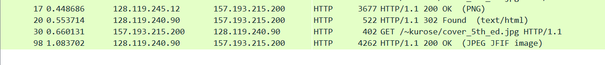

# Labo computernetwerken 1 – Wireshark

## Is your browser running HTTP version 1.0, 1.1, or 2? What version of HTTP is the server running?

http.request.method==GET

# How many HTTP GET request messages did your browser send? To which Internet addresses (URL) were these GET requests sent?

http.request.method==GET
3urls:
http://gaia.cs.umass.edu/wireshark-labs/HTTP-wireshark-file4.html
http://gaia.cs.umass.edu/pearson.png
http://manic.cs.umass.edu/~kurose/cover_5th_ed.jpg

# Can you tell whether your browser downloaded the two images serially, or whether they were downloaded from the two web sites in parallel? Explain

Ze worden serially gedownload.

# . When your browser’s sends the HTTP GET message for the second time, what new field is included in the HTTP GET message?µ

Authorization field is added

# What is the IP address and TCP port number used by the client computer (source) that is transferring the alice.txt file to gaia.cs.umass.edu? 

http.host=="gaia.cs.umass.edu used as filter
follow tcp stream

# What is the IP address of gaia.cs.umass.edu? On what port number is it sending and receiving TCP segments for this connection?

http.host=="gaia.cs.umass.edu used as filter

tcp ports used: 
- Source Port: 61689
- Destination Port: 80

# How many bytes of data are contained in the payload (data) field of this TCP segment? Did all of the data in the transferred file alice.txt fit into this single segment?

http.request.method==POST
711 bytes

# What is the length (header plus payload) of each of the first four data-carrying TCP segments?

