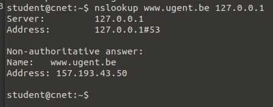

# Labo computernetwerken 3 – DNS client and server

## vraag 1:

Test met je Linux client je eigen DNS-server: vraag een query aan via jouw eigen server.
Gebruik hiervoor het localhost adres.




## Vraag 2:

Caching server zonder forwarder: voer de volgende zaken na elkaar uit:
a. maak de DNS cache leeg

```
rndc flush
```
b. bekijk je de DNS pakketten die langs de NIC van de server gaan met tcpdump6:
root@cnet:~# tcpdump -ti eth0 -n port 53

c. voer een query uit naar een URL. Voer hem nogmaals uit, en merk dat het antwoord
komt zonder extra DNS verkeer in tcpdump!
Werkt jouw DNS-server momenteel iteratief of recursief? Leg uit aan de hand van het verkeer
dat je kunnen “capturen” hebt.

```
Eerste nslookup na het leegmaken van de dns cache gaat de lookup naar buitenaf dus veel informatie in de tcp dump. Bij een tweede nslookup naar dezelfde URL zal er geen extra informatie meer aanwezig zijn in de tcp dump aangezien de informatie nu in de cache aanwezig is.

werkt iteratief
```


## Vraag 3:

Werk je DNS-server bij, zodat hij een forwarder contacteert voor zijn eigen aanvragen. Herstart
de bind9 server; clear de cache; monitor opnieuw het verkeer zoals in de vorige vraag. Werkt de
server nu iteratief of recursief? Leg uit aan de hand het DNS verkeer dat je kon opvangen.

```
recursief , de request gaat naar de forwarder ipv naar buitenaf
```


$TTL 86400 ; 24 hours could have been written as 24h or 1d
example.com. 1D IN SOA ns1.example.com. hostmaster.example.com. (
 2002022401 ; Serial
 3H ; Refresh
 15 ; Retry
 1w ; Expire
 3h ; Default TTL
 )
 IN NS ns1.test.com. ; in the domain
 IN NS ns2.arthurcoupe.com. ; external to domain
 IN MX 10 mail.another.com. ; external mail provider
; server host definitions
ns1 IN A 192.168.0.1 ; name server definition
serv1 IN A 10.0.2.22 ; general server definition
ftp IN CNAME serv1.example.com. ; ftp server definition
www IN CNAME serv1 ; web server definition
; non server domain hosts
bill IN A 192.168.0.3
fred IN A 192.168.0.4