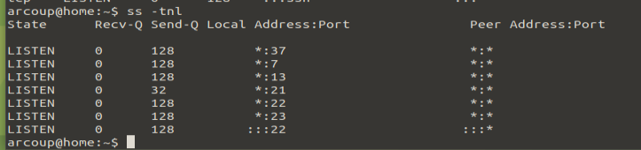

# Labo computernetwerken 3 – Sockets

## Opdracht server ports

### 1. Bekijk welke poorten er allemaal actief zijn op jouw VM. Stop de DNS daemon bind9, en bemerk het verschil. Welke poorten gebruikt de DNS daemon allemaal?

```bash
ss -ntl
```


Stop de DNS daemon bind9 en bemerk het verschil. Welke poorten gebruikt de DNS daemon allemaal?

```bash
service bind9 stop
```


Dns daemon gebruikt poort 53.

### 2. Verwijder het programma ‘cups-daemon’:apt purge cups-daemon Welke poort was er in gebruik door de software (voor printer-services die we niet gebruiken)?

```bash
apt purge cups-daemon
```


poort 631 was in gebruik

### 3. Installeer de software apache2. Kan je merken welke poort er actief geworden is?

```bash
sudo apt install apache2
```


poort 80 is actief geworden

### 4. Installeer de software nginx. Deze daemon wil echter niet opstarten. Leg uit waarom

```bash
sudo apt install nginx
```

Poort 80 is al bezet door apache2

### 5. Stel de poort van apache2 in op 8080 – dit kan via het bestand /etc/apache2/ports.conf. Herlaaddeze daemon. Kan je de wijziging zien in je listening sockets? Zou je nu nginx kunnen opstarten? Leg uit.

```bash
systemctl start nginx
```


apache draait op poort 8080 en nginx op poort 80

## Intermezzo 1: HTTP op de CLI

### 1. Start wireshark op binnen je VM, met sudo wireshark

```bash	
sudo wireshark
```

## 2. Terwijl je captured op de interface, vraag je met curl de ugent pagina op. Zie je het TCP gesprek horend bij deze applicatie?


## Active Sockets – client and daemon software
## 4 Opdracht actieve sockets

### 1. Maak een SSH verbinding naar home.test.atlantis.ugent.be ; bekijk voordien en nadien de uitkomst met ss –tn. Leg uit vanaf wanneer een poortnummer in gebruik is op een client

```bash
ss -tn
ssh -l arcoup home.test.atlantis.ugent.be
```


poort 22 wordt gebruikt

### 2. Maak nadien een tweede SSH verbinding vanaf dezelfde client. Leg uit a.d.h.v. het resultaat van ss hoe de pakketten van deze beide verbindingen door de computers uit elkaar kunnen gehouden worden.


Krijgen lokaal verschillende poortnummers

### 3. Bekijk de listening sockets op deze server. Leg van 3 poorten uit welke functie ze vervullen op de server. Hint: bekijk de inhoud van het bestand /etc/services.



poort 22 ssh
poort 21 ftp
poort 23 telnet

### 4. Je installeerde reeds de nginx webserver. Kan je met netcat testen of hij werkt op jouw systeem? Hoe doe je dat? Kan je met wget het index.html downloaden

```bash
netcat -vz localhost 80
```


```bash
wget http://localhost/index.html
```


### 5. Je installeerde reeds de apache2 webserver, en werkte het poortnummer bij. Kan je met netcat testen of hij werkt op jouw systeem? Hoe doe je dat? Kan je met wget het index.html downloaden?

```bash
netcat -vz localhost 8080
wget http://localhost:8080/index.html
```


### 6. Stel een poortnummer open op je computer (netcat listening socket), zodat je er vanuit een 2e terminal met netcat mee kan verbinden. Kan je dit combineren met input/output redirection (zie vorig labo), zodat je het bestand /etc/services kan sturen van de ene terminal naar de andere doorheen deze TCP socket? Hint: http://www.microhowto.info/howto/copy_a_file_from_one_machine_to_another_using_netcat

```bash
netcat -l -p 1234 < /etc/services
netcat -q 0 localhost 1234
```


## Intermezzo 2: Secure CoPy (SCP)
### 1) Aanmaken “tarball”

Gebruik het commando tar om van deze structuur een archief te maken met de naam
gundams.tar.bz2

Je zorgt daarbij uiteraard ook voor de nodige compressie met bzip2.

```bash
tar -cjf gundams.tar.bz2 gundams
```

### 2) SCP kopiëren

Stuur dit archief aan de hand van scp vanop de command line naar de server
home.test.atlantis.ugent.be

```bash
scp gundams.tar.bz2 arcoup@home.test.atlantis.ugent.be:~
```


Gebruik WinSCP om het archief te kopiëren van deze server naar een Windows PC en pak daar
het archief uit

```bash
winSCP gundams.tar.bz2 arcoup@home.test.atlantis.ugent.be:~
```

## 1) Opdracht nmap

### 1. Voer een basisscan uit op scanme.nmap.org. Welke poorten zijn open? Welke poorten werden allemaal getest?
### 2. Voer een scan uit op de server home.test.atlantis.ugent.be. Welke poorten zijn er allemaal actief op deze server?
### 3. Start WireShark op, en start capturing. Scan met nmap je eigen Linux VM op poort 25. Stop het capturen. Welke status krijg je terug? Kan je dit linken aan de TCP-pakketten die je ziet?
### 4. Herhaal dit experiment, maar test nu poort 25 op de server. home.test.atlantis.ugent.be. Welke status krijg je terug? Kan je dit linken aan de TCP-pakketten die je ziet?
### 5. Na stap 3 en 4 zou je het onderscheid moeten kunnen maken tussen open en filtered als status. Voer een basis portscan uit op www.meemoo.be, en formuleer welk advies je zou kunnen geven aan de beheerder van de firewall van deze server.